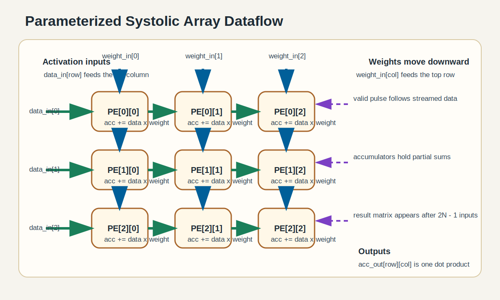
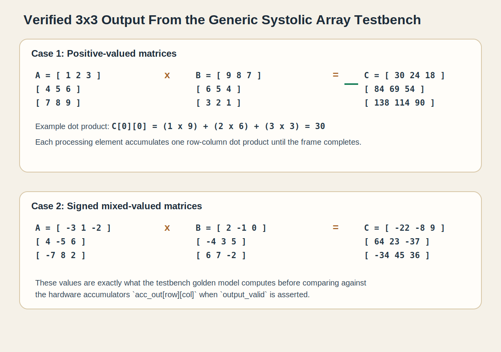

# SystemVerilog Systolic Array

This project implements a parameterized `N x N` systolic array for signed matrix multiplication in SystemVerilog. Activations stream from left to right, weights stream from top to bottom, and each processing element accumulates one output term of the result matrix.

## Overview

- `mac.sv`: Signed multiply-accumulate block
- `pe.sv`: Processing element built around one MAC
- `systolic_2x2.sv`: Fixed 2x2 reference array
- `systolic_array.sv`: Generic parameterized array
- `tb_mac.sv`: Unit test for the MAC
- `tb_systolic_2x2.sv`: Testbench for the fixed 2x2 array
- `tb_systolic_array.sv`: Self-checking testbench for the generic array
- `tb_systolic_consistency.sv`: Confirms `systolic_2x2` matches `systolic_array` when `N=2`

## Architecture



Each PE receives:

- one activation from the left
- one weight from the top
- one valid pulse aligned with the streamed operands

Each cycle, a PE:

1. multiplies `data_in * weight_in`
2. adds the product into its local accumulator
3. forwards the activation to the PE on the right
4. forwards the weight to the PE below

For an `N x N` array, one matrix frame is injected over `2N - 1` cycles. In the generic module this is tracked by:

- `input_valid` / `input_ready` for frame loading
- `accepted_count` to count accepted stream beats
- `output_valid` / `output_ready` for result handoff

## Example Output



The default generic testbench uses `N=3` and verifies two cases.

### Case 1: Positive values

`A`

```text
[ 1  2  3 ]
[ 4  5  6 ]
[ 7  8  9 ]
```

`B`

```text
[ 9  8  7 ]
[ 6  5  4 ]
[ 3  2  1 ]
```

Expected result `C = A x B`

```text
[  30   24   18 ]
[  84   69   54 ]
[ 138  114   90 ]
```

Why `C[0][0] = 30`:

```text
(1 x 9) + (2 x 6) + (3 x 3) = 9 + 12 + 9 = 30
```

The same pattern applies to every PE: each one accumulates the dot product of one row of `A` and one column of `B`.

### Case 2: Signed mixed values

`A`

```text
[ -3   1  -2 ]
[  4  -5   6 ]
[ -7   8   2 ]
```

`B`

```text
[  2  -1   0 ]
[ -4   3   5 ]
[  6   7  -2 ]
```

Expected result `C = A x B`

```text
[ -22   -8    9 ]
[  64   23  -37 ]
[ -34   45   36 ]
```

This is "why we got that output": the array is not producing arbitrary values. Every accumulator stores the exact sum of signed products for one row-column pair, and the testbench compares the hardware output against a software-computed golden matrix.

## Verification Behavior

The current testbenches check more than just arithmetic:

- correct signed multiply-accumulate behavior in `mac.sv`
- correct 2x2 reference operation
- generic 3x3 matrix multiplication against a golden model
- backpressure handling: `output_valid` stays asserted until `output_ready`
- frame completion behavior: `input_ready` deasserts once the frame is full
- consistency between the fixed 2x2 design and the parameterized array

Observed pass messages from the testbench sources:

- `tb_systolic_array passed for 3 x 3 frames`
- `tb_systolic_consistency passed`

## Run In Vivado XSIM

From the generated simulation directory:

```powershell
cd SystolicAI.sim\sim_1\behav\xsim
cmd /c compile.bat
cmd /c elaborate.bat
cmd /c simulate.bat
```

## Run MAC Test With Icarus Verilog

```powershell
& 'E:\iverilog\bin\iverilog.exe' -g2012 -o tb_mac.vvp `
  SystolicAI.srcs\sources_1\new\mac.sv `
  SystolicAI.srcs\sim_1\new\tb_mac.sv

& 'E:\iverilog\bin\vvp.exe' tb_mac.vvp
```

## Key Design Notes

- signed 8-bit operands by default
- 32-bit accumulator by default
- synchronous clear through `clear_acc`
- enable control through `en`
- simple streaming handshake for frame input and result output

## Limitations

- no external memory interface
- no DMA, tiling, or buffering subsystem
- no AXI-Stream wrapper
- no synthesis, timing, or area summary documented here
